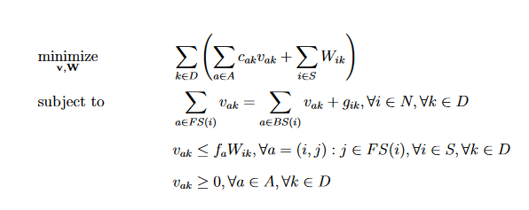

# Optimal-Strategy-Transit-Assignment

Optimal-Strategy-Transit-Assignment is a repository for the static transit assignment python code. The mode was proposed by [Spiess and Florian (1987)](https://www.sciencedirect.com/science/article/pii/0191261589900349). 

## What is optimal strategy transit assignment?
This is an assignment model for the transit systems where the service is perceived in terms of frequencies. The passengers traveling between an origin-destination pair served by multiple transit lines are faced with the problem of which transit route to board. Due to the randomness in the arrival time of buses, the passengers adopt strategy which minimizes the expected travel time. A **strategy** is defined as a set of rules when applied helps a passenger to move from origin to destination in a transit network. [Nguyen and Pallottino 1988](https://www.sciencedirect.com/science/article/abs/pii/037722178890327X) formalized the idea of strategy in a graph-theoretic framework and called it a **hyperpath**. Let v_ak be the flow on link a destined to destination k and let W_ik be the wait time of all the passengers visiting node i destined to destination k. The, the transit assignment can be formulated as a linear program given below:

